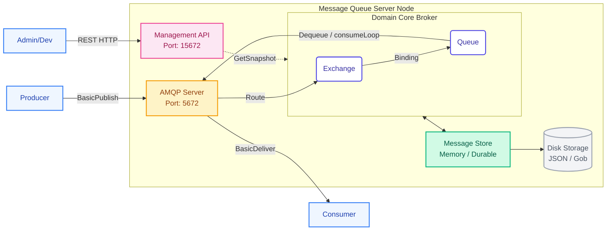

# Message Queue (MQ) project using Go

EriOnn-MQ is a lightweight, high-performance Message Broker written in Go, implementing the **AMQP 0-9-1** protocol. It provides a reliable and scalable messaging foundation with a focus on ease of deployment and professional management tools.

## Scope

- AMQP 0-9-1 protocol
- broker
- queue
- producer
- consumer
  - Ack, Nack, Reject
- Direct, Fanout, and Topic exchanges for messaging patterns.
- Durability: Gob snapshot-based persistence for queues and messages to survive restarts.
- HTTP API for Dashboard

## Architecture



## Project Structure

```text
erionn-mq/
├── cmd/                # Entrypoint, initializes the system and connects components.
├── internal/
│   ├── amqp/           # AMQP 0-9-1 protocol handling (Server implementation, frame encoding/decoding, method handling).
│   ├── core/           # Core business logic (Broker coordinator, Exchange routing, Queue management, Bindings).
│   ├── store/          # Data storage layer (Memory-based store, Gob snapshot for durability).
│   ├── config/         # System configuration management (Settings, ENV, Defaults).
│   └── management/     # HTTP Management API & Dashboard (Admin UI, Monitoring endpoints).
└── go.mod              # Module declaration and dependency management.
```

## Getting Started

```bash
# Run the server
go run ./cmd
```

## Future Scope

- Write Ahead log store message
- Graceful shutdown
- Matrix export